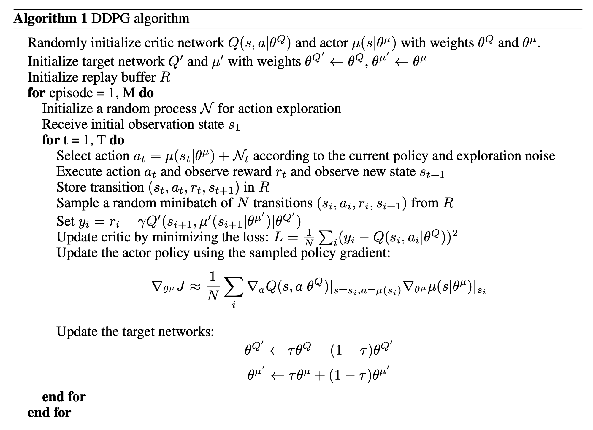
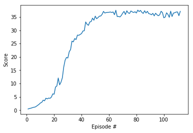

# Project report

## Learning algorithm

The learning algorithm used is DDPG as implemented in ddpg-pendulum exercise.
Here is this algorithm from [original article](https://arxiv.org/abs/1509.02971):



## Algorithm parameters

### The neural networks have following structure:

1. Actor

	- Hidden: (input, 256) - ReLU
	- Hidden: (256, 128) - ReLU
	- Output: (128, 4) - TanH

2. Critic

	- Hidden: (input, 256) - ReLU
	- Hidden: (256 + action_size, 128) - ReLU
	- Output: (128, 1) - Linear

### Parameters used in agent:

- replay buffer size: 2e-5
- minibatch size: 128
- discount factor: 0.99
- tau (the coefficient of soft update of target parameters): 1e-3
- learning rate of the actor: 1e-4 
- learning rate of the critic: 2e-4
- L2 weight decay: 0
- Ornstein-Uhlenbeck noise parameters: 
	- theta: 0.15
	- sigma: 0.2

## Results

Plot:



Log:

```
Episode 112	Score: 37.10	Average Score: 30.14
Environment solved in 112 episodes. Average Score: 30.14
CPU times: user 23min 28s, sys: 1min 3s, total: 24min 31s
Wall time: 28min 55s
```

## Testing log

```
Episode: 1 Score: 38.91
Episode: 2 Score: 39.47
Episode: 3 Score: 39.51
Episode: 4 Score: 39.36
Episode: 5 Score: 39.32
```